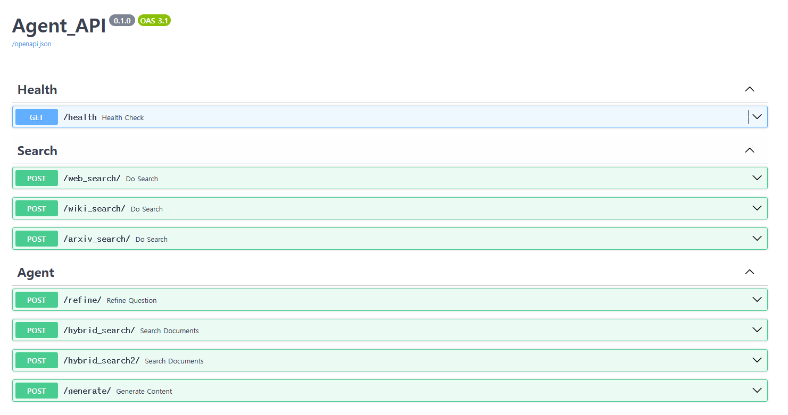

# Agent Backend

### 1. Main Features
- RAG based on various knowledge, like elasticsearch, tavily, wiki, arxiv, etc.
- agents built with langgraph (query refine - retrieve - generate)
- support multi-turn conversation
- converting fastapi into fastapi-mcp

### 2. Command
- python server.py

